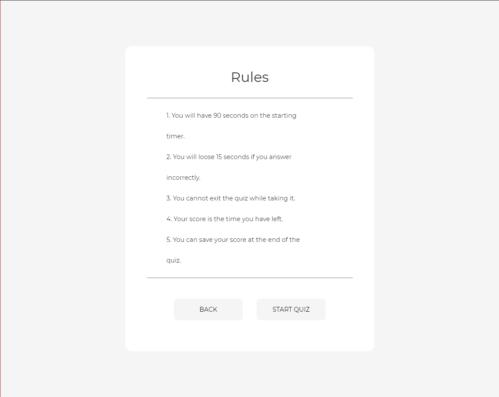

# Timed Quiz

## Description

I created a quiz for Javascript fundamentals. 

## Table of Contents

* [Features](#Features)
* [Links](#Links)
* [Screenshots](#Screenshots)
* [Language](#Language)
* [Code-Example](#Code-Example)
* [Reference](#Reference)
* [Tests/Issues](#Tests/Issues)
* [Contribute/Credits](#Contribute/Credits)
* [License](#License)

## Features

- [x] Has a countdown timer.
- [x] Can deduct time if the user miss a question.
- [x] Can show you if you are right or wrong depending on the color (red - wrong, green - right).
- [x] Can save your score at the end of the quiz into the local storage.
- [x] Can save your initials, or name at the end of the quiz into the local storage.
- [x] Can save both your name and your score into a leaderboard page.

## Links

* [Project Repo: Timed Quiz](https://github.com/jeishu/timed-quiz)
* [GitHub Page: Timed Quiz](https://jeishu.github.io/timed-quiz/)

## Screenshots

How the page looks like when you open it.


How the rules page look like when you click start quiz on the home page.



How the answer look like if you answer correctly.


How the answer look like if you answer incorrectly.


## Language

* JavaScript
* HTML
* CSS
* ~~jQuery*~~

*jQuery was used, but switch over back to vanilla JavaScript. The jQuery code can be found on './js/jQuery.js'

## Code-Example

HTML: 
* '.___btn' -> Used to indicate buttons 
* '.___Page' -> Used to indicate pages
```
<div class="homePage">
    <h1>JavaScript Quiz</h1>

    <!-- button paths to the rules page -->
    <div class="homeStartBtn">Start Quiz</div>
    <!-- button for the highscores -->
    <div class="homeLbBtn">Leaderboard</div>
</div>
```

CSS: 
* A good 99% of the styling is in CSS. All buttons are made from div tags with hover styling.
```
.homeStartBtn:hover, 
.homeLbBtn:hover, 
.rulesHomeBtn:hover, 
.rulesStartBtn:hover,
.lbHomeBtn:hover,
.formHomeBtn:hover,
.formLbBtn:hover {
    cursor: pointer;
    color: #f5f5f5;
    background: rgb(202, 202, 202);

    transition: .5s;
}
```

JavaScript: 
* Sections are being shown as pages through the style.display = ""; in JS
    * Pages are shown after they are called on with eventlisteners.
* document.querySelector
    * this selector is heavily used to grab DOM elements.
    * '___EL' is used to indicate DOM Elements when creating the variable for them
```
homeStartBtnEl.addEventListener("click", function() {
    let rulesHide = true;

    if (rulesHide === true) {
        homePageEl.style.display = "none";
        rulesPageEl.style.display = "block";
        lbPageEl.style.display = "none";
        quizPageEl.style.display = "none";
    }
});
```

jQuery: 
* The framework was replaced by vanilla JavaScript.
* $('') used to grab DOM elements
    * hide() and show() used to hide and show pages
```
 homeStartBtnEl.on("click", function() {
    let rulesHide = true;

    if (rulesHide === true) {
        homePageEl.hide();
        rulesPageEl.show();
        lbPageEl.hide();
        quizPageEl.hide();
    }
});
```

## Reference

These are websites I used to aid me in learning different syntax and different methods, functions, etc for Javascript.

> - [Developer Mozilla](https://developer.mozilla.org/en-US/) || Learn a good amount of methods and functions here.
> - [W3School](https://www.w3schools.com/) || I pulled some questions fro the JavaScript quiz there and some questions I replaced with my own answers.
> - [StackOverflow](https://www.stackoverflow.com/) || Most issues I had were resolved from looking at other people's problems.

These websites aid me in creating this README.

> - [GitHub Docs](https://docs.github.com/en/free-pro-team@latest/github/writing-on-github/basic-writing-and-formatting-syntax) || Learn most of my README syntax here.
> - [Akash Nimare](https://medium.com/@meakaakka/a-beginners-guide-to-writing-a-kickass-readme-7ac01da88ab3) || Based my README from his person.
> - [Mark Down Guide](https://www.markdownguide.org/cheat-sheet/) || README Syntax

## Tests/Issues

 jQuery
- I started off using jQuery, but learn that so functions and methods within jQuery likes being used with other jQuery methods and functions.
- Being limited in my knowledge in jQuery, I switched to vanilla JavaScript.
- The learning process definitely help me learn and get more comfortable with JS and jQuery.

Syntax, Misspell, etc
- Most of my problems within my code is that I would forget I set a variable to one name and make another.
- I would forget to capitalize when needed to stay consistent.

Score Keeping
- I had a good amount of issues getting my scores rendering out.
- At first came out undefined, but Dan, a good classmate of mine, was able to help me see some syntax and misspell errors.

Console Log
- I haven't use much of console.log before, but during the making of this application, I use it very often to check functions, type of value, etc.

Breakpoints in Chrome Dev Tool
- I heavily used it towards the making of the quiz to see what is being call on and what is not working and what values my variables are calling.
- Seeing live code at work is extremely nice to utilize.

Leaderboard Page
- I realized that my homepage doesn't load the list of scores and user name, but after the quiz, it does.
- Still need to resolve that issue.

## Contribute/Credits

- My class instructor, Calvin
- My tutor, Sangeetha
- Dan, the extra eye that saw my problem with why my score rendering and name rendering was undefined.

## License

MIT © [Jeremy Zhu](https://github.com/jeishu)

